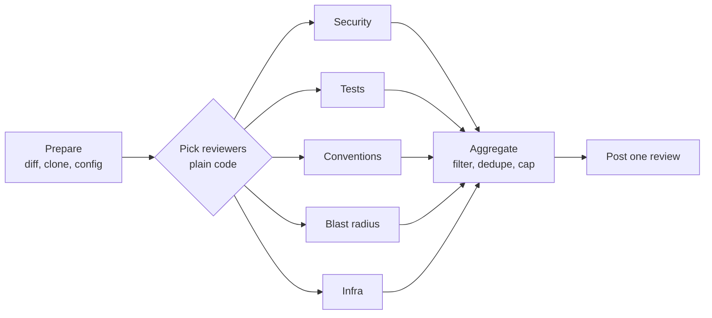

# Code Reviewer Agent Setup

Sep 23, 2026 · Source: https://claude.ai/code/artifact/2863da19-4aa0-44a1-a1aa-5c65847d5a01 · Spec: [spec.md](spec.md) · Plan: [implementation-plan.md](implementation-plan.md)

We use a plain-code orchestrator that decides which specialist reviewers run, then runs them in parallel. Each reviewer is the same agent loop with its own prompt, tools and data. Reviewers only read code and return findings. Only the orchestrator posts to GitHub.

## Orchestration options

We pick option 3: plain code chooses the reviewers, and only the reviewers are agents.

| Option | How it works | Good | Bad |
| --- | --- | --- | --- |
| 1. One agent does everything | A single agent with every tool reviews security, tests, conventions and more, one after another | Simplest to build; one prompt | Slow (no parallelism); one huge prompt that tries to do everything, so quality drops; hard to test or tune one area; one failure loses the whole review |
| 2. Agent orchestrator with child agents | A parent agent reads the PR, decides which child agents to call, and merges their answers | Flexible; children can be specialized | The parent is another LLM call that can pick wrong or skip reviewers; harder to predict cost and time; harder to debug |
| 3. Plain-code orchestrator with agent reviewers (chosen) | Code checks simple rules ("did IaC files change?") to pick reviewers, runs them in parallel, then merges and filters the results in code | Predictable, cheap and testable; reviewers run in parallel; one reviewer failing doesn't break the rest; adding a reviewer is one new module | Less flexible: routing rules are written by hand |

Why option 3: choosing which reviewers apply is a simple yes/no question about the diff, so it doesn't need an LLM. We save the model for the parts that need judgment.

Only the five reviewers in the middle call the model. Every other step is ordinary code.

## How each reviewer works

Every reviewer follows the same four steps, and only step 3 uses the model:

1. **Check:** should I run on this PR? (plain code)
2. **Helpers:** non-LLM tools find candidates, such as scanners and code parsing.
3. **Agent:** the shared loop reads code with tools and confirms or rejects the candidates.
4. **Filter:** code drops anything that breaks the reviewer's rules.

**Shared agent loop:** up to 15 turns, a 150k-token budget and a 12-minute deadline. The loop ends when the model calls `submit_findings`. If it never does, a final call forces it to.

**Tools the agent can call (all read-only, limited to the repo copy):** `read_file`, `grep`, `list_dir`, `get_diff`, `find_references`, `find_tests`, `get_conventions`, and `submit_findings` to finish.

| Reviewer | Runs when | Helpers (before the agent) | Agent tools | Prompt, in short | Filter (after the agent) |
| --- | --- | --- | --- | --- | --- |
| Generic (phase 0) | Always | None | `read_file`, `grep`, `list_dir` | "Report only high-severity bugs you verified in code. No style comments. No comment beats a weak one." | Confidence ≥ 0.8, max 10 |
| Security | Any source file changed | gitleaks (secrets), Semgrep (SQL injection, unsafe deserialization), a route finder | `read_file`, `grep`, `list_dir` | "For each candidate, decide if it's real. Cite the source and sink. Check new routes against the repo's auth pattern." | Must match a scanner candidate (except missing auth) |
| Tests | Non-test code changed | Tree-sitter lists changed functions and new branches; `find_tests` finds their tests | `read_file`, `grep`, `find_tests` | "Match each new branch to a test. For each gap, write a test in this repo's style." | One finding per function; skip trivial code |
| Conventions | A conventions file exists | Loads the team's rules (C-01, C-02, ...) | `read_file`, `get_conventions` | "Flag only violations of these listed rules, and cite the rule number." | Must cite a real rule ID |
| Blast radius | A signature, export or API contract changed | Tree-sitter compares old and new signatures; `find_references` lists callers | `read_file`, `grep`, `find_references` | "Check each caller this PR didn't update. Does it break?" | Always notes "this repo only, may miss dynamic calls" |
| Infra | IaC files, or AWS or database calls, changed | Infracost (cost change); tree-sitter finds calls inside loops | `read_file`, `grep` | "Flag cost jumps and performance risks. Phrase unproven ones as questions." | Dollar amounts only if Infracost produced them |

**Models:** reviewers that use tools run on a larger model. Simple classification, like the conventions learner, uses a smaller, cheaper one.

## Data each reviewer needs

The orchestrator collects all data once, before any reviewer runs, and packs it into one `ReviewContext`. Reviewers never fetch data from GitHub themselves.

**Every reviewer gets:**

- PR title and description
- The diff, with line numbers
- A copy of the repo at the PR's latest commit
- The repo's config file (`.github/bandwidth-reviewer.yml`)

**Extra data per reviewer:**

| Reviewer | Extra data | Where it comes from |
| --- | --- | --- |
| Generic | Full text of changed files (up to 60k characters) | Repo copy |
| Security | The repo's auth pattern (for example, "routes use `@require_auth`"); routes meant to be public | Knowledge store (learned on the first security review); config `public_routes` |
| Tests | Changed functions and their new branches; matching test files; the test naming pattern | Tree-sitter on the repo copy; `find_tests`; config `test_globs` |
| Conventions | The team's numbered rules, each with example comments | `conventions.md` in the repo, or the learner's snapshot in the knowledge store |
| Blast radius | Old and new function signatures; every caller in the repo; API contract files | Tree-sitter on both the old and new code; `find_references`; file-type matching |
| Infra | Monthly cost before and after; changed IaC files; the cost alert threshold | Infracost on the old and new code; the diff; config `cost_threshold_usd_month` |

**Where the stored data lives:**

- **Repo copy:** a temporary clone, deleted after each review.
- **Knowledge store:** saved facts about each repo (conventions, auth pattern, repo summary). Documents live in S3, with an index in DynamoDB.
- **Convention learner:** a separate background job that reads the last 200 merged PRs' review comments and writes the team's rules to the knowledge store.
