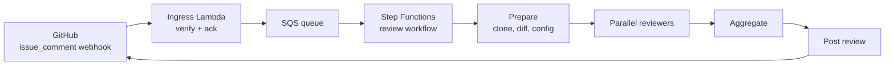

# Bandwidth AI Code Reviewer — Spec

Sep 22, 2026 · Source: https://claude.ai/code/artifact/e4acf7e4-c3ac-40e1-a8d9-25e68c81e513

A GitHub App, hosted on AWS, that posts focused code reviews on a pull request when someone comments `@bandwidth-reviewer review`. It runs a set of specialist reviewers (security, test gaps, team conventions, blast radius, infra performance and cost) on a shared platform and posts one combined review.

## Overview

Generic AI review bots get muted because they are noisy. This reviewer bets on precision: a few narrow, high-confidence checks and rules the team already agrees with.

**Goals**

- Catch a short list of high-impact issues (security, missing tests, broken callers, infra cost) before a human reviewer looks.
- Enforce the conventions each team already enforces in human reviews, learned from its own history.
- Keep adoption friction low: install once, trigger with one comment.
- Keep source code inside Bandwidth's AWS account (Amazon Bedrock for the model).

**Non-goals**

- Approving or blocking merges. The bot only posts `COMMENT` reviews and never approves or requests changes.
- Replacing linters, formatters or CI tests. The bot skips anything a configured linter already catches.
- Auto-fixing code or pushing commits.
- Reviewing every PR automatically in v1. Reviews run only when someone asks.

**Success metrics**

| Metric | Target | How it's measured |
| --- | --- | --- |
| Useful-comment rate | 70% or more of comments rated useful | 👍/👎 reactions and whether the thread gets resolved with a code change |
| Security reviewer precision | 90% or more true positives | Labeled evaluation set plus reactions |
| Time to review | Under 5 min median from comment to posted review | Run records: comment time to post time |
| Time to first review | Under 10 min median from install to the first posted review in a repo | Installation events plus run records |
| Repeat use | 50% or more of installed repos trigger a review weekly after the first month | Invocation logs |
| Cost per review | Under $0.50 median | Bedrock token usage plus AWS billing tags |

## User experience

Users install the GitHub App once, then comment on any PR to get a review. There's no collaborator step and no per-repo setup unless they want to customize. The target is a first review within 5 minutes of install for someone following the usage guide, with nothing else to read first. In practice (people finding a PR, getting around to it), the tracked metric is under 10 minutes median.

**Who uses it**

| Person | When they meet the bot | What they need | Gives up if |
| --- | --- | --- | --- |
| Repo or org admin | Once, at install | To know what the app can read and write, and where code goes | The permissions screen is unexplained, or the bot posts things nobody asked for |
| PR author or reviewer (Bandwidth backend engineer) | Every time they want a second pair of eyes on a PR | A useful review in a few minutes, from one command, with no noise | The first review is noisy or wrong, or nothing visibly happens after they comment |

**Install (admin, about 1 minute)**

1. An org or repo admin opens the app's page and clicks **Install**, choosing all repos or specific ones. A one-page install guide (`INSTALL.md` in the bot's repo, linked from the app page) explains every permission, what gets posted, and that code only goes to Bandwidth's AWS account.
2. Nothing is posted on install. The convention learner runs quietly in the background (see Reviewer specs). It only opens a PR proposing `.github/bandwidth-reviewer/conventions.md` when someone comments `@bandwidth-reviewer learn`. The first review in each repo mentions that this is available.
3. An optional `.github/bandwidth-reviewer.yml` sets which reviewers run, paths to ignore and thresholds. No config is needed for the first review.

**First review (developer, under 5 minutes)**

1. Comment `@bandwidth-reviewer review` on any PR.
2. Within a few seconds: 👀 appears on the comment, and a `bandwidth-reviewer` check appears in the PR's checks list, marked in progress: "Reviewing 12 files at `abc1234`, usually about 3 minutes."
3. About 3 minutes later: the review is posted, the check completes with a one-line result ("2 high-severity issues" or "No issues found"), and 🚀 replaces 👀.
4. The first review in each repo ends with a short "How to use me" footer: the commands, the config file, and how to give feedback. Later reviews show a one-line footer with a link to the usage guide.

**Commands** (posted as a PR comment on the Conversation tab)

| Command | What it does |
| --- | --- |
| `@bandwidth-reviewer review` | Runs the default reviewer set from config. A bare `@bandwidth-reviewer` does the same |
| `@bandwidth-reviewer review security tests` | Runs only the named reviewers (`security`, `tests`, `conventions`, `blast-radius`, `infra`) |
| `@bandwidth-reviewer review --full` | Reviews the whole PR, not just commits since the last bot review, and re-reviews a commit that was already reviewed |
| `@bandwidth-reviewer learn` | Runs the convention learner now and opens (or updates) the conventions PR |
| `@bandwidth-reviewer help` | Replies with the command list and the config actually in effect |

- Commands are case-insensitive, and only the first non-empty line of the comment is read. The trigger must be the exact word `@bandwidth-reviewer` (so `@bandwidth-reviewer-dev`, the team's test app, never triggers the production app).
- Only people with `admin` or `write` permission on the repo can run commands (checked through the GitHub permissions API). Anyone else gets one short reply per PR: "Only people with write access to this repo can request reviews." This keeps outsiders from spending the LLM budget without leaving them confused.
- **Escape hatches:** add the label `skip-ai-review` to a PR to make the bot ignore it; use `ignore_paths` in config for generated or vendored code; set any reviewer's `enabled: false`.

**What a review looks like**

- One GitHub review per run, event type `COMMENT`.
- Inline comments on diff lines. Each starts with a tag such as `[security · high]` and gives the problem, why it matters and a fix, using a ```` ```suggestion ```` block when the fix is a small, exact code change, so it can be applied with one click.
- A summary body grouped by reviewer, listing findings that couldn't be placed on a diff line, what was skipped (files ignored, reviewers not applicable) and the reviewed commit SHA.
- A footer with the reviewer versions used, a request for 👍/👎 on each comment, and a link to the usage guide.

**When something goes wrong**

Every problem the bot reports says what happened, why, and what to do next. When the bot itself fails, the `bandwidth-reviewer` check completes as **neutral** (never red, so it doesn't look like the PR is blocked) with the title "Review didn't run" and the details, plus a 😕 reaction. No extra PR comment is posted.

| Situation | What the user sees |
| --- | --- |
| PR over the size limit | The review covers the 150 largest files. The summary lists the skipped files and says: "Split the PR, or add generated paths to `ignore_paths`." |
| Invalid config | The review runs with defaults for the broken keys. The summary says, for example: "`.github/bandwidth-reviewer.yml` line 7: `max_comment` isn't a known key. Did you mean `max_comments`? Using the default (10)." |
| Model service unavailable after retries | Neutral check, "Review didn't run": "The model service was unavailable after several retries over about 5 minutes, so nothing was posted. Try again in a few minutes with `@bandwidth-reviewer review`." |
| Commit already reviewed | Reply: "Already reviewed `abc1234` (link). Comment `@bandwidth-reviewer review --full` to review it again." |
| Unknown command | Reply: "I don't know `revew`. Did you mean `review`?" followed by the command list. |
| PR closed or labeled `skip-ai-review` | Reply: "This PR is closed (or labeled `skip-ai-review`), so I'm not reviewing it." |
| Review already running on this commit | Reply: "Already reviewing `abc1234` (started 2 minutes ago). The review will appear here when it's done." |
| Review ran out of time | Whatever was found is posted, and the summary says which files weren't reviewed and suggests splitting the PR. |
| Unexpected internal error | Neutral check, "Review didn't run": "Something went wrong on our side (run `r-8f2c`). Nothing was posted. Please share the run ID in the help channel." |

**Check results:** no findings → `success`; findings → `neutral` with a one-line count; the bot's own errors → `neutral` with "Review didn't run". The bot never uses `failure`, because it never blocks merges.

**Getting help:** the usage guide (`USAGE.md`) covers commands, config and feedback, and every review links to it. Questions go to a Slack channel owned by the team running the bot (name to be confirmed with Bandwidth).

## System architecture

A webhook Lambda accepts GitHub events and queues them. A Step Functions workflow then runs each review: it prepares a workspace, runs the applicable reviewers in parallel, merges their findings and posts one review.



The Prepare step clones the repo and gathers context. The Map step runs one container Lambda per reviewer. Aggregate merges and filters their findings, and Post writes a single GitHub review.

**Request flow**

1. GitHub sends an `issue_comment` webhook to the Ingress Lambda through an API Gateway HTTP API.
2. Ingress checks `X-Hub-Signature-256`, ignores bot senders and anything that isn't a command, stores the delivery ID in DynamoDB to drop duplicates, puts a job on SQS and returns `200` within about a second. It makes no GitHub API calls. GitHub gives up after 10 s.
3. A small Lambda reads from SQS, checks that the commenter has `admin` or `write` permission (via `GET /collaborators/{user}/permission`, not `author_association`), skips PRs that are closed or labeled `skip-ai-review`, pins the PR's `base_sha` and `head_sha`, claims the run in DynamoDB on `{repo}#{pr}` + `{head_sha}` (a second request while one is running gets an "already reviewing" reply), and only then reacts 👀, opens an in-progress `bandwidth-reviewer` check on `head_sha` and starts one Step Functions execution.
4. **Prepare**: get an installation token, fetch the diff from `compare/{base_sha}...{head_sha}`, clone the head SHA (token passed only as a fetch header, never saved in `.git/config`) into S3 or EFS, parse the changed functions and classes, load config and conventions, decide which reviewers apply.
5. **Map**: run each applicable reviewer in parallel (container Lambda, 15 min timeout, up to 10 GB ephemeral storage).
6. **Aggregate**: validate each finding against the diff, remove duplicates, apply thresholds and caps, rank by severity.
7. **Post**: re-check the PR head (note in the summary if new commits arrived), skip if this app already reviewed `head_sha`, then one `POST /repos/{owner}/{repo}/pulls/{n}/reviews` call with `commit_id = head_sha`, complete the check with a one-line result, replace 👀 with 🚀 and record the run. If the bot fails, the check completes as neutral ("Review didn't run") with a message that says what happened and what to do.

The first mock (phase 0) runs these same stages in-process in one worker Lambda, without Step Functions. Step Functions is added in phase 1, when there is a second reviewer to run in parallel.

**AWS components**

| Component | Service | Notes |
| --- | --- | --- |
| Webhook endpoint | API Gateway HTTP API + Lambda | Stateless, only verifies and queues |
| Job queue | SQS + dead-letter queue | Absorbs bursts, retries failed jobs |
| Orchestration | Step Functions (Standard) | Parallel reviewers, retries, timeouts, visual run history |
| Reviewer compute | Lambda container images (ECR) | Include git, ripgrep, tree-sitter, Semgrep, gitleaks, Infracost. Move to Fargate if a repo is too large |
| Workspace storage | EFS or S3 | Holds the clone shared between Prepare and the reviewers |
| Model | Amazon Bedrock (Claude) | Code stays in Bandwidth's account. Model is chosen per reviewer |
| State | DynamoDB | Deliveries, runs, posted comments, feedback |
| Knowledge + logs | S3 | Conventions snapshots, repo summaries, full prompt/response logs |
| Secrets | Secrets Manager | App private key, webhook secret |
| Scheduling | EventBridge Scheduler | Weekly convention refresh, feedback sync |
| Observability | CloudWatch + X-Ray | Metrics, alarms, traces |
| Infrastructure as code | AWS CDK (Python) | One stack per environment (dev, prod) |

All Lambda functions, the agent and reviewer code, the evaluation harness and the CDK app are written in **Python 3.12**. The implementation plan lists the specific libraries.

## Shared platform layers

Six shared layers do most of the engineering work. Each reviewer only adds a prompt, a set of tools and a filtering policy on top.

**1. Workspace**

- A shallow clone at the head SHA (`git clone --depth 50 --filter=blob:none`), plus a fetch of the base SHA so it can diff against the merge base. Phase 0 uses a simpler form: the diff comes from the compare API and the clone is a depth-1 fetch of the head SHA into the worker's `/tmp`.
- A `ReviewContext` object passed to every reviewer: PR metadata, the parsed diff (files, hunks, line numbers for each side), changed functions and classes, repo config, conventions, and the last reviewed SHA for incremental reviews.
- Skipped by default: lockfiles, vendored code, generated code, minified files, binaries, and anything matching `ignore_paths`.

**2. Code intelligence**

- Tree-sitter parsers for TypeScript/JavaScript, Python, Java, Go and Kotlin (to be confirmed against Bandwidth's stack). They map diff hunks to the functions and classes they touch and find the branches inside them.
- `find_references(symbol)`: a ripgrep search for the name, then a tree-sitter check that each hit is a real use, not a comment or string. It works across languages but is imprecise. Precise per-language indexes can replace it later without changing the interface.
- `find_tests(symbol | file)`: test files located by naming convention (`*.test.ts`, `test_*.py`, `*Test.java`) and by searching test directories for references.
- Contract file detection: OpenAPI/Swagger, `.proto`, GraphQL schemas, database migrations, exported types in shared packages.

**3. Agent runtime**

- A Bedrock tool-use loop with a limit on turns (default 15) and on tokens per reviewer.
- Read-only tools: `read_file(path, start_line?, end_line?)`, `grep(pattern, glob?)`, `list_dir(path)`, `find_references`, `find_tests`, `get_diff(file)`, `get_conventions()`. The model ends its turn by calling `submit_findings(findings[])`.
- Tools can only read inside the workspace, never under `.git/`, and never through a symlink leading outside it. The model has no network access, no shell and no tool that writes anything.
- Prompt caching uses a moving cache point on the last message of each turn, so every turn reuses the whole previous conversation. The token budget counts uncached input, cache writes and output.
- The final answer must follow the finding JSON schema. Invalid output gets one retry with the validation error, then a final call that forces `submit_findings`. A wall-clock deadline (12 minutes in phase 0) triggers the same forced finish, so partial results are posted instead of the run timing out.

**4. Knowledge store**

- Per repo: the learned conventions (from the merged `conventions.md` file, which takes priority, or the latest learned snapshot), a repo summary (languages, frameworks, layout, auth pattern, test layout), and cached results such as "how this repo guards endpoints".
- S3 holds the documents and DynamoDB holds the index, keyed by `installation_id#repo`.
- The summary is rebuilt when the default branch changes a lot, or weekly.

**5. Aggregator and policy**

- Checks each finding: its file and line must be on the RIGHT side of a diff hunk. Findings that can't be placed on a line go into the summary.
- Removes duplicates: the same file and a line within ±3 plus a similar message means one finding, and the higher severity wins.
- Drops findings below each reviewer's `min_confidence`, and anything the linter already flags (if the repo has a linter config the platform knows how to run).
- Caps inline comments per review (default 10 in phase 0, raised to 25 once specialist reviewers ship), ranked by severity, then confidence, then reviewer priority.
- On incremental reviews, suppresses findings identical to ones posted earlier on the same PR.

**6. Feedback and evaluation**

- Every run is logged: inputs, prompt version, model, raw output, the filtered findings and the IDs of posted comments.
- A nightly sync reads reactions and thread-resolution status on posted comments and stores them per finding, per reviewer and per prompt version.
- An offline evaluation harness replays labeled PRs through any reviewer and reports precision and recall (see Non-functional requirements).

## Reviewer contract and finding schema

Every reviewer implements the same interface and returns findings in the same schema. That's what lets reviewers be added, run in parallel and filtered independently.

```python
from typing import Protocol

class Reviewer(Protocol):
    name: str                 # "security", "tests", ...
    version: str              # bump when the prompt or logic changes; logged with every finding
    default_model: str        # Bedrock model ID, overridable in config
    min_confidence: float     # 0-1, overridable in config
    max_findings: int

    def applies_to(self, ctx: ReviewContext) -> bool: ...   # e.g. infra only if IaC files changed
    def run(self, ctx: ReviewContext, tools: ToolSet) -> list[Finding]: ...
```

```python
from typing import Literal
from pydantic import BaseModel, Field

class Finding(BaseModel):
    reviewer: str
    rule_id: str                     # e.g. "security/sql-interpolation", "conventions/C-07"
    file: str
    line: int                        # line in the new version; must fall in a diff hunk to be inline
    end_line: int | None = None      # for multi-line comments
    severity: Literal["critical", "high", "medium", "low", "info"]
    confidence: float = Field(ge=0, le=1)   # the model's calibrated estimate
    title: str                       # one line
    body: str                        # what's wrong, why it matters, how to fix; markdown
    suggestion: str | None = None    # exact replacement code for lines line..end_line
    evidence: list[str] = []         # e.g. "src/api/users.py:88 calls this without the new arg"
```

- Reviewers never call the GitHub API directly. Only the Post step writes to GitHub.
- Reviewers must return in under 10 minutes. A timed-out reviewer is recorded as skipped in the summary and doesn't fail the review.
- Adding a reviewer means adding one module plus its evaluation cases. The workflow, aggregator and poster don't change.

## Reviewer specs

Five reviewers ship in the order below. Each spec gives its scope, how it works, what it needs and how it keeps precision high.

| Reviewer | Runs when | Default confidence bar | Key dependencies |
| --- | --- | --- | --- |
| `security` | Any source file changed | 0.8 | gitleaks, Semgrep, agent runtime |
| `tests` | Non-test source files changed | 0.7 | Tree-sitter, `find_tests` |
| `conventions` | A conventions file or snapshot exists | 0.7 | Knowledge store, learner job |
| `blast-radius` | A changed function signature, exported symbol or contract file | 0.75 | `find_references`, contract detection |
| `infra` | IaC or infra config files changed | 0.8 (cost), 0.85 (perf) | Infracost, `cdk synth` |

### Security (narrow)

**Scope:** only these four checks. Nothing else, however tempting.

| Rule | Candidate source | What the LLM checks |
| --- | --- | --- |
| `security/hardcoded-secret` | gitleaks on added lines | Is it real, or a test fixture, placeholder, example or public key? |
| `security/sql-interpolation` | Semgrep rules for string-built SQL in each supported language | Does user-controlled data reach it? Is the query parameterized somewhere else? |
| `security/unsafe-deserialization` | Semgrep rules (`pickle.loads`, `yaml.load` without a safe loader, Java `ObjectInputStream`, `eval`/`Function` on JSON, etc.) | Is the input untrusted? |
| `security/endpoint-missing-auth` | Agent: finds new or changed route handlers in the diff | Does the handler have the repo's auth guard? |

- **How it works:** scanners propose candidates and the LLM confirms or rejects each one using surrounding code. The LLM never adds findings of its own except for missing-auth.
- **Missing auth:** on first use, the agent learns the repo's auth pattern (decorators, middleware, router-level guards, allow-listed public routes) and caches it in the knowledge store as `auth_pattern`. Later reviews compare new routes against it. If a route is intentionally public, users can add it to `security.public_routes` in config.
- **Precision rules:** every finding must cite the exact source and sink, or the missing guard. When unsure, drop it. Default severity is `high`, and `critical` is used for live secrets.
- **Secrets:** the comment never repeats the secret. It shows only the first 4 characters and the type, and says to rotate the key, not just delete it.

### Test gaps

**Scope:** new or changed logic in non-test code that no test in the PR or repo exercises.

1. Tree-sitter lists changed functions and, inside them, **new branches**: `if`/`else`, `switch` cases, early returns, `catch` blocks, ternaries and guard clauses added or changed in the diff.
2. `find_tests` finds tests for each function, looking first at test files changed in this PR, then at existing tests.
3. The agent reads those tests and matches branches to assertions. It lists branches with no test that exercises them.
4. For each gap it writes a **concrete test case**: a test name, setup and inputs, expected result, and a code snippet in the repo's test framework and style, based on a neighboring test.

- One finding per function, not per branch, with the missing cases listed inside.
- Skip trivial code: getters, pure delegation, logging-only branches and generated code.
- Later: if CI uploads a coverage report (lcov or Cobertura) as a workflow artifact, use its line coverage instead of inference. Mutation testing is a stretch goal and out of scope.

### Conventions

**Scope:** only rules this team has shown it cares about, each backed by real past review comments.

**Learner (offline job, its own Step Functions workflow)**

1. Runs quietly on install and weekly (EventBridge), storing a learned snapshot. It only opens or updates the conventions PR when someone comments `@bandwidth-reviewer learn`, so installing the app never produces a surprise PR.
2. Fetch the last 200 merged PRs (configurable) and all their human review comments, skipping bots, plus `CONTRIBUTING.md`, the style guide and linter configs.
3. Batch the comments through the LLM, which classifies each as a convention, a bug, a question or other, and pulls out a general rule for conventions.
4. Group similar rules together and keep those seen at least 3 times from at least 2 reviewers. Store each with its count, 2–3 real example comments with links, and a short good/bad code example.
5. Drop rules a configured linter already enforces.
6. Open or update a PR adding `.github/bandwidth-reviewer/conventions.md`, with rules numbered `C-01`, `C-02` and so on. The team edits and merges it. The merged file is the source of truth, and the learned snapshot is only used before the first merge.

**Review time:** the reviewer sees the conventions list and the diff and flags only violations of listed rules. Each comment cites its rule (`Per C-07: ...`) and links to the conventions file.

### Blast radius

**Scope:** changes that can break code outside the diff.

- **Signature changes:** for each changed function or method signature (parameters, return type, thrown errors, async-ness) or removed or renamed export, `find_references` lists call sites. The agent checks each one that the PR doesn't touch against the new signature and behavior, and flags the ones that break.
- **Behavior changes to shared code:** if a function used in more than N places (default 5) changes meaningfully, post one info-level finding summarizing the change and listing the callers most likely affected.
- **Contract changes:** changes to OpenAPI, protobuf, GraphQL, database migrations or exported types in shared packages get a finding naming the change type (added, breaking or deprecated) and known consumers in this repo.
- **Stated limits:** the summary always says the analysis covers this repo only and can miss dynamic or reflective calls. The bot never claims its list is complete.

### Infra (performance + cost)

**Runs when:** Terraform, CDK, CloudFormation, Serverless, Kubernetes, Helm or Dockerfiles change, or the code contains AWS SDK or database calls inside changed functions.

**Cost**

- Terraform: run `infracost diff` on the base versus the head plan. Report the monthly cost change in total and for the top resources. Flag if it goes over `infra.cost_threshold_usd_month` (default $100).
- CDK: `cdk synth`, then Infracost on the synthesized CloudFormation where supported. Otherwise the LLM estimates, clearly labeled.
- LLM-flagged code patterns, with no dollar figure: DynamoDB scans, S3 or other AWS calls in loops, unbounded log volume, polling instead of events, NAT gateway data paths.

**Performance** (a narrow list, like security)

- N+1 queries: database or API calls inside loops.
- Missing pagination or limits on list endpoints or queries.
- Missing timeouts and retries on network calls. Retries without backoff.
- Synchronous blocking work on request paths.
- Infra sizing: Lambda memory and timeout, missing autoscaling, provisioned concurrency changes, database instance class changes.

Performance and cost-pattern comments are phrased as questions ("Is this list bounded?") unless Infracost backs the number.

## Per-repo configuration

Config lives in `.github/bandwidth-reviewer.yml` on the default branch. Every key is optional, and a missing file means defaults apply. The bot reads the default branch's version, not the PR's, so a PR can't turn off its own review.

```yaml
version: 1
reviewers:
  default: [security, tests, conventions, blast-radius, infra]
  generic:
    min_confidence: 0.8
  security:
    min_confidence: 0.8
    public_routes: ["GET /health", "POST /webhooks/*"]
  tests:
    enabled: true
    test_globs: ["**/*.test.ts", "tests/**/*.py"]
  conventions:
    file: .github/bandwidth-reviewer/conventions.md
    learn_from_last_n_prs: 200
  blast-radius:
    shared_callers_threshold: 5
  infra:
    cost_threshold_usd_month: 100
ignore_paths: ["**/generated/**", "**/*.snap", "docs/**"]
skip_label: skip-ai-review
max_comments: 10
model_overrides:
  security: <bedrock-model-id>
```

- Keys that are valid in the schema but not implemented yet (for example `conventions` in phase 0) are accepted and noted once in the summary as "not supported yet", so copying this example never produces errors.
- Unknown keys or invalid values: the bot uses defaults for those keys and says so in the review summary, naming the line and suggesting the closest valid key.
- A JSON Schema for the file is published with the usage guide, so editors with YAML support (VS Code, JetBrains) autocomplete and validate it.
- `@bandwidth-reviewer help` replies with the config it's actually using.

## Releases and versioning

Changes to the bot change what every team sees on their PRs, so they roll out carefully.

- **Two apps:** `bandwidth-reviewer-dev` (installed on the team's sandbox repos) gets every change first; `bandwidth-reviewer` (installed on Bandwidth repos) gets it after the evaluation set passes.
- **Versioned reviewers:** each reviewer has a version (for example `security@1.2.0`) shown in the review footer and logged with every finding, so a change in behavior can be traced to a release.
- **New reviewers start opt-in:** a new reviewer is left out of the default set for its first 2 weeks. Teams can turn it on early in config.
- **Changelog:** `CHANGELOG.md` in the bot's repo lists user-visible changes (new reviewers, changed defaults, new commands). The usage guide links to it.
- **Config compatibility:** the config file has a `version` key. A breaking change bumps it; the bot keeps reading the old version for at least one release and says in the summary what to change.

## Non-functional requirements

**Security and privacy**

- GitHub App permissions: Pull requests read & write, Contents read, Issues read & write (for replying to comments), Checks read & write (for the progress check), Metadata read. Nothing else.
- Installation tokens are fetched for each run and expire in 1 hour. They're never logged, never written to disk (git gets them only as a fetch header), and never passed to the model. The aggregator also redacts anything that looks like a GitHub token, AWS key or private key before posting.
- All code and prompts stay in Bandwidth's AWS account. Bedrock with no retention of inputs or outputs for training.
- **Prompt injection:** PR content is untrusted. The model's tools are read-only and limited to the workspace. Its output is only JSON findings, which the aggregator checks against the schema and diff. Comment bodies are sanitized: strip @mentions to prevent pinging people, and strip HTML.
- Webhook signatures are always verified. Commenters without write access (including forked-PR authors) get one reply per PR saying write access is required; nothing is reviewed.
- Workspaces are deleted when the run ends. S3 logs are encrypted with KMS, kept for 90 days and accessible only to the team's IAM roles.

**Limits and scale**

| Limit | Default | Behavior when exceeded |
| --- | --- | --- |
| Changed files per review | 150 | Review the top 150 by lines changed and list the skipped ones in the summary |
| Diff size | 5,000 changed lines | Same as above |
| Reviews running per installation | 3 (phase 0: 5 across all installations) | Extra jobs wait in SQS |
| Reviewer timeout | 10 min | Reviewer marked skipped |
| Whole-run timeout | 20 min (phase 0: 12-minute deadline inside a 15-minute worker) | Post whatever finished, noted in the summary |

- GitHub API: use conditional requests and back off on secondary rate limits. The learner job paginates slowly and can take hours on large repos.

**Cost controls**

- A token budget per reviewer per run. Use a smaller model for classification, routing and summaries, and a larger one for reviewers that use tools.
- Bedrock prompt caching for system prompts and conventions.
- Incremental reviews by default: only commits since the last reviewed SHA.
- A monthly AWS Budgets alarm, and cost tracked per installation via tags and logged token counts.

**Observability**

- CloudWatch metrics: reviews started, completed and failed, findings per reviewer, the fraction of findings dropped by the aggregator, tokens and cost per run, and p50/p95 duration.
- Alarms: dead-letter queue depth above 0, failure rate above 10% over 1 hour, Bedrock throttling.
- Every run has a link from the review summary to an internal run ID for debugging.

**Evaluation**

- Each reviewer has a labeled test set with expected findings, including negatives: clean PRs that should get zero comments. A third of the set is held out and never used for tuning. Precision is reported with raw counts (for example 14/19) and only counts once there are at least 30 findings.
- From phase 1, each reviewer's set has at least 20 PRs, and CI runs the evaluation harness on any change to a prompt or reviewer and fails if precision drops more than 5 points. In phase 0 the evaluation is run manually.
- Live precision comes from reactions and resolved threads, tracked per reviewer version.

## Roadmap and open questions

The platform ships first with one generic reviewer (the first mock, planned in a separate doc). Specialist reviewers follow in order of value and shared dependencies.

| Phase | Deliverable | Depends on |
| --- | --- | --- |
| 0 | First mock: comment trigger, workspace, one strict generic reviewer, aggregator, posting, logging, evaluation harness (2 Lambdas, no Step Functions) | Nothing |
| 1 | Security reviewer, CI-gated evaluation, Step Functions orchestration | Phase 0 |
| 2 | Code intelligence layer, then the test-gap and blast-radius reviewers | Phase 1 |
| 3 | Convention learner job + conventions reviewer | Phase 0 logging, knowledge store |
| 4 | Infra reviewer (Infracost first, then perf heuristics) | Phase 2 code intelligence |
| 5 | Feedback sync dashboards, a `dismiss` reply for false positives, coverage-report ingestion, optional automatic review on PR open | Phases 1–4 |

**Open questions**

- [ ] Whose AWS account does this run in? Code from Bandwidth repos may only go to an account Bandwidth approves.
- [ ] Does Bandwidth use github.com or GitHub Enterprise Server? This changes the API base URL and whether webhooks can reach AWS.
- [ ] Which languages and frameworks come first? This decides which tree-sitter grammars and Semgrep rules to write.
- [ ] Which Bedrock models are approved in Bandwidth's AWS account, and in which region?
- [ ] Is IaC mostly Terraform or CDK? This decides how much the cost reviewer can rely on Infracost.
- [ ] Does CI already produce coverage reports we can read?
- [ ] Who approves the GitHub App install for pilot repos, and which 2–3 repos are the pilot?
- [ ] Which Slack channel should users go to for help, and who answers it?
- [ ] Is reviewing Bandwidth code with an LLM subject to any data-handling policy beyond staying in their AWS account?
